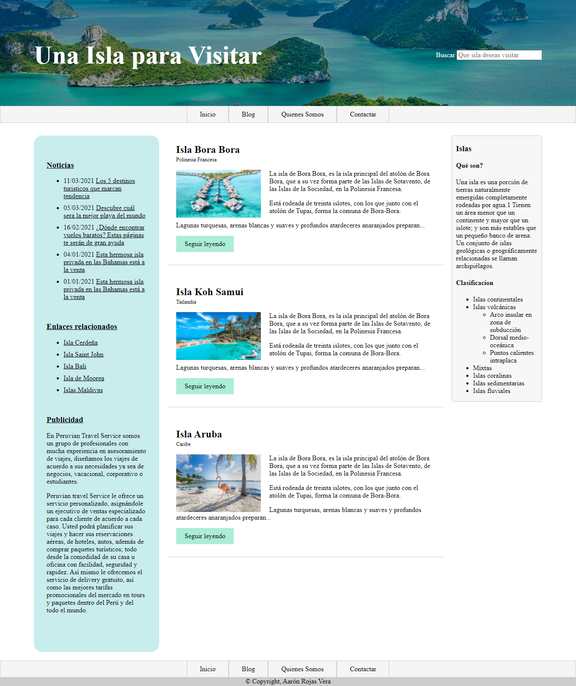
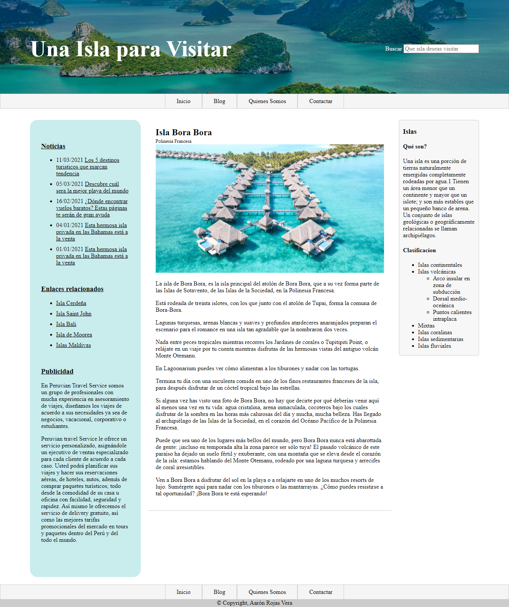
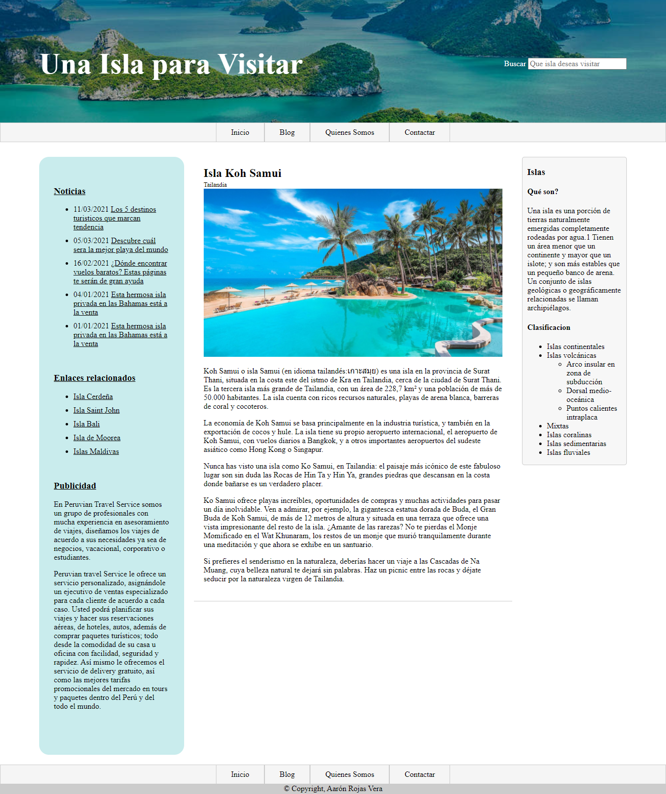
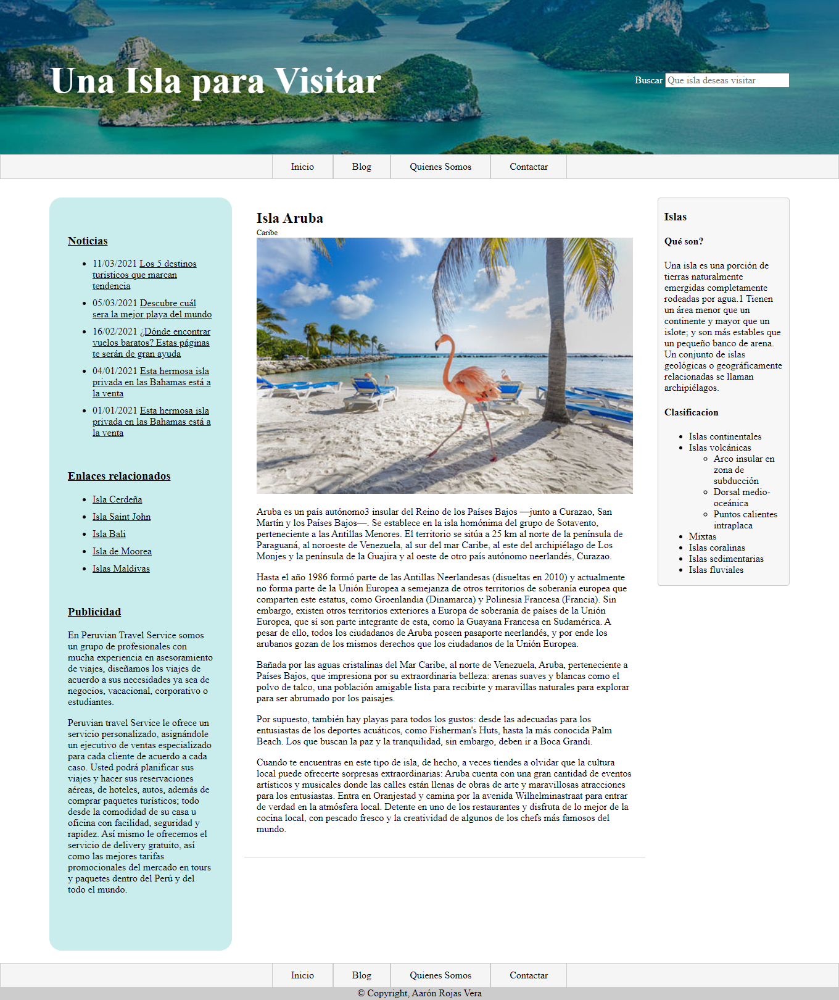
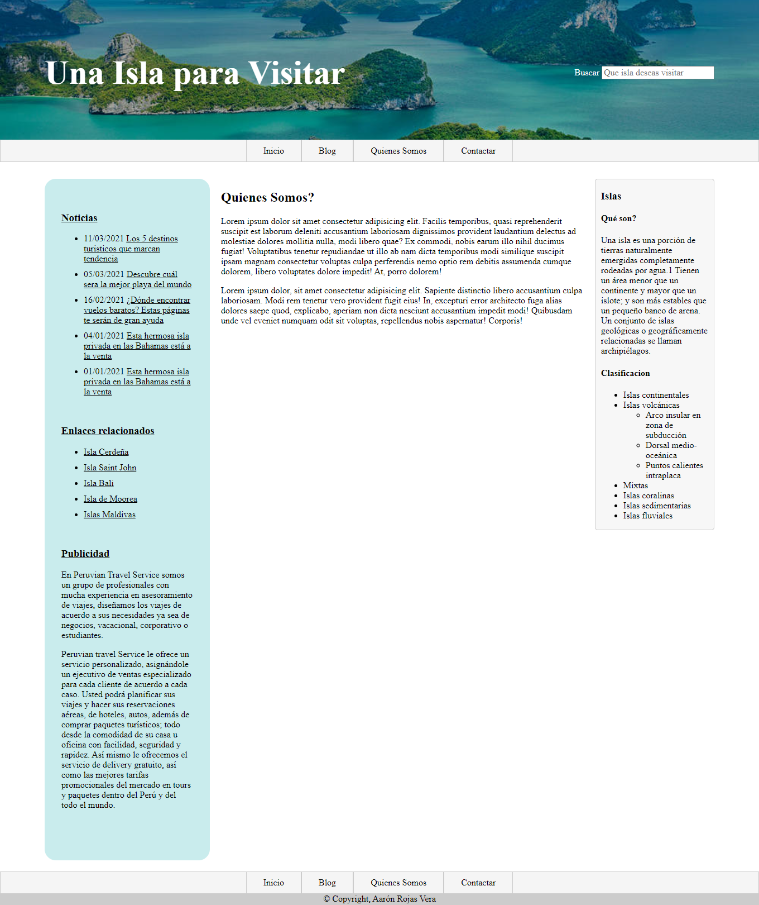
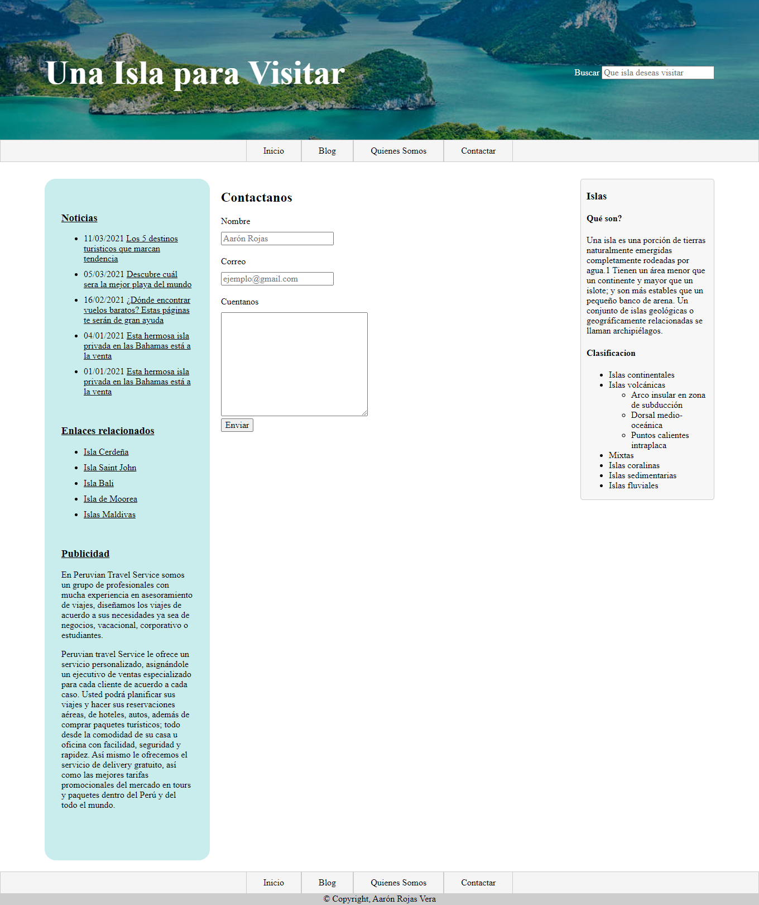

# Blog de Islas - Una Isla Para Visitar
Práctica de HTML y CSS de un Blog de Islas con página de inicio, entrada de blog, quienes somos y contáctanos. **11/03/2022**

<strong>Imagen:</strong> Página de Inicio.

## Entrada de Blog

<strong>Imagen:</strong> Página de Entrada de blog - Bora Bora.

<strong>Imagen:</strong> Página de Entrada de blog - Koh Samui.

<strong>Imagen:</strong> Página de Entrada de blog - Aruba.

## Quienes somos

<strong>Imagen:</strong> Página de Quienes Somos.

## Contáctanos

<strong>Imagen:</strong> Página de Contáctanos.

